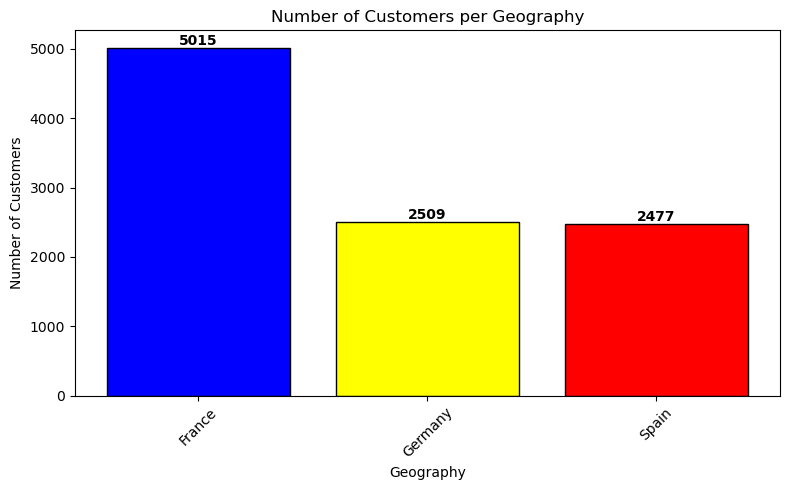
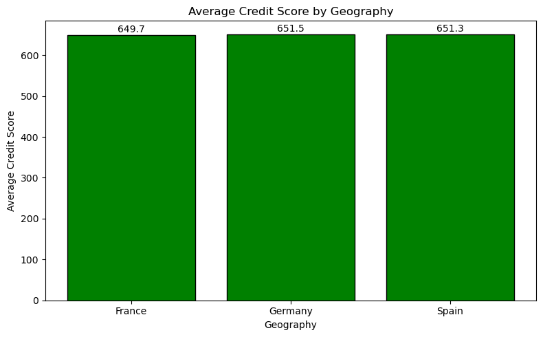
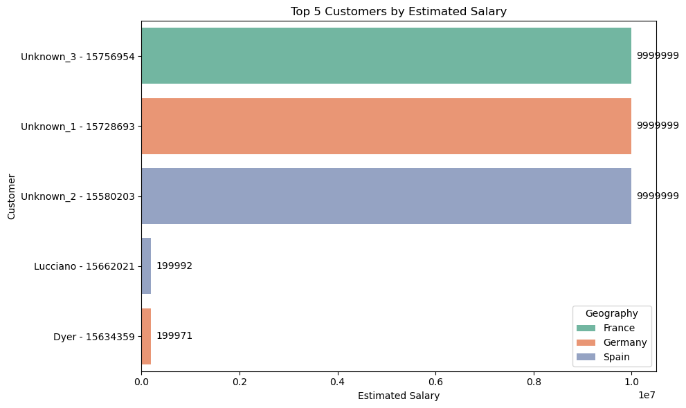
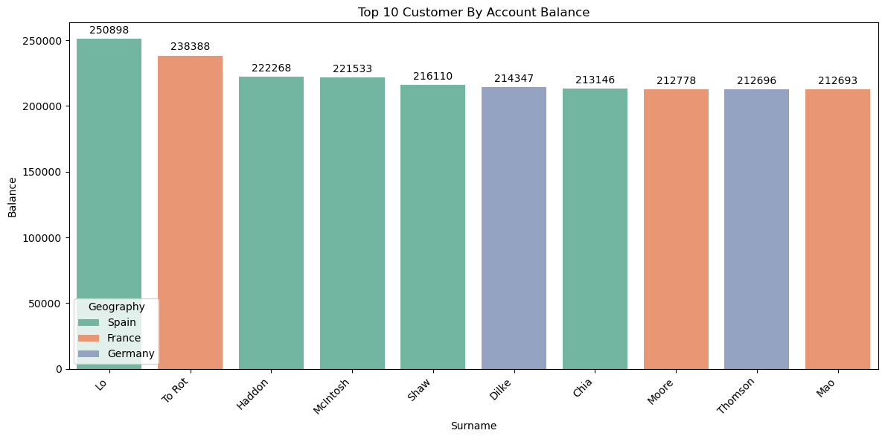
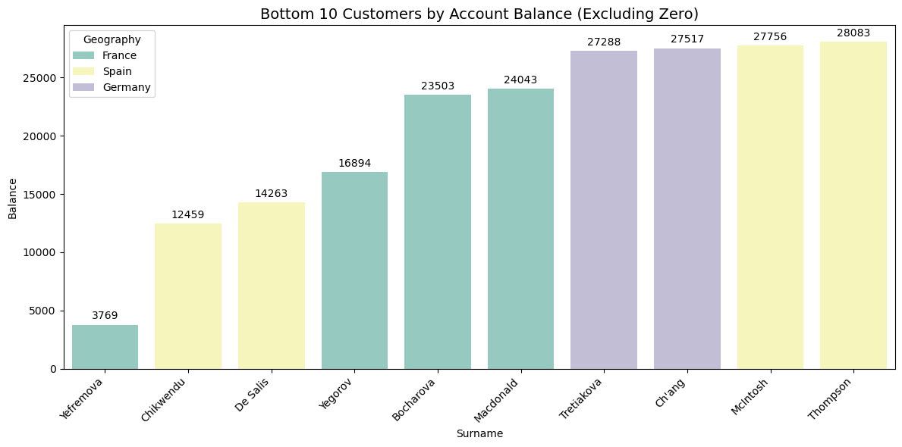
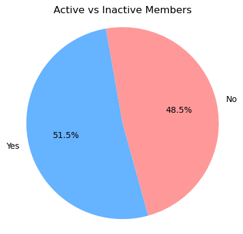
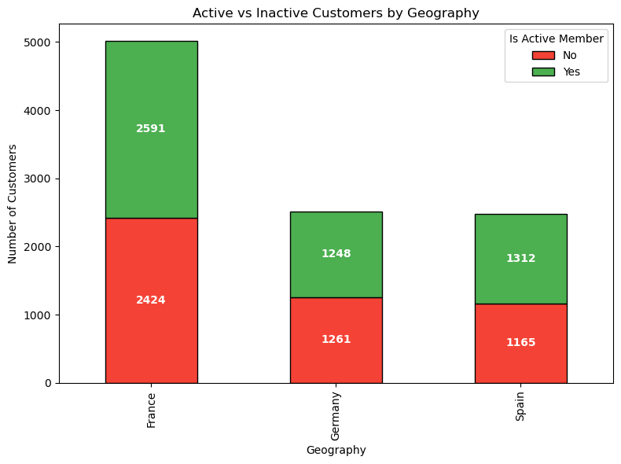
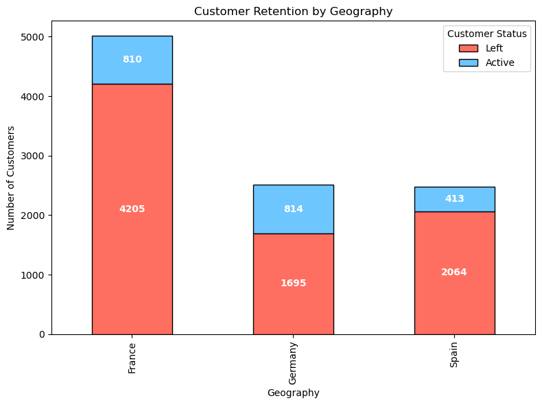

## Bank Customer Analysis

## Overview 

`Problem Statement`
A bank wish to understand the demographic and financial characteristics of her customers, identifying trends and patterns in customer engagement, and highlighting potential areas for business improvement 

`objective`
Using the datasets provided i would try to profer solutions that would help us understand areas where the company can improve and gain high customer retention.

`Approach`

To achieve this, i would approach the analysis using the CRISP-DM (Cross-Industry Standard Process for Data Mining) Framework  

- Properly understand the business and data

- Prepare the data for analysis

-  Answer questions to help us achieve our objectives

- Draw conclusions

- Prepare a summary 

## Data 

The data folder contains 2 datasets Account info and Customer info. Each data file contains attribute information and see below the attribute description. 

`CustomerId` : A unique identifier for each customer

`Surname` : The customer's last name

`CreditScore` : A numerical value representing the customer's credit score

`Geography` : The country where the customer resides (France, Spain or Germany)

`Gender` : The customer's gender (Male or Female)

`Age` : The customer's age

`Tenure` : The number of years the customer has been with the bank

`Balance` : The customer's account balance

`NumOfProducts` : The number of bank products the customer uses (e.g., savings account, credit card)

`HasCrCard` : Whether the customer has a credit card (1 = yes, 0 = no)

`IsActiveMember` : Whether the customer is an active member (1 = yes, 0 = no)

`EstimatedSalary` : The estimated salary of the customer

`Exited` : Whether the customer has churned (1 = yes, 0 = no)

### Insight

- The total number of Customers are 10001.

- France has the highest number of Customer based on geography, which is approximately 50% of the Customer tally.

- 5457 Male And 4544 Female Customers respectively

- The Average credit score of the 3 country are close,  Germany on an average has the highest credit score 

Tenure was categorized as shown below:
   
   value <= 2 : short-termed
   2 < value >=6 : Medium-termed
   value > 6 : long-termed

- 3 out of the top 5 earners has no name and their salary can be considered to be an outlier, Hence the Lucciano and dyer is considered the 2 top earner respectively.

- Lo has the highest balance amount of $250898 before exiting, 50% of the top 10 holders are from Spain. Also 50% of the top 10 balance has exited and 50% aren't active members.

- Yefremova has the least balance amount of $3769.

- 51.5% of the CUstomers are Active while 48.5% are inactive

- In France 52% of customers are Active members while 48% are Inactive members; In Spain 53% are Active Customers while 47% are Inactive members; In Germany 52% are Active members while 47% are Inactive members

- Customer retention across the 3 countries are very low, France has 84% of customers that has exited Using the bank services;Spain has 83% of Customers that has exited using the bank services; Germany has 68% of Customers that has exited Using the bank services.

### Conclusion, Recommendation and Future work

The Objective of this analysis is to give insights and possible solutions that would help understand areas where the company can improve and gain high customer retention.

`Improve Customer Retention`
- High Exit Rates in France and Spain (84% & 83%) indicate a serious retention issue.
Action: Conduct exit surveys to identify dissatisfaction drivers.
 Follow-up: Implement loyalty programs or personalized customer outreach to reduce churn.

 `Targeted Campaigns by Geography`
- Since France holds ~50% of the customer base, marketing efforts here will have the greatest impact.
Action: Design localized campaigns focusing on the needs of French customers.
Spain: Since 50% of high-balance customers are from Spain, consider premium or wealth management services targeted at this segment.

`Engagement Based on Tenure`
- Segmenting by short-, medium-, and long-term tenure can guide lifecycle marketing.
Action:
 Short-term customers may need onboarding support.
 Medium-term may benefit from upselling or cross-selling.
 Long-term may be at risk of churn — consider loyalty perks.

`Focus on Inactive Members`
- Around 48.5% of customers are inactive.
Action: Launch reactivation campaigns (e.g., special offers, check-ins).
        Personalize outreach based on prior behavior or account activity.